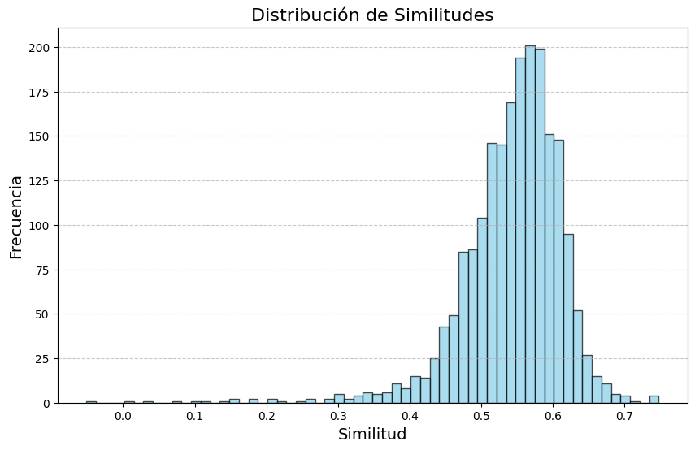
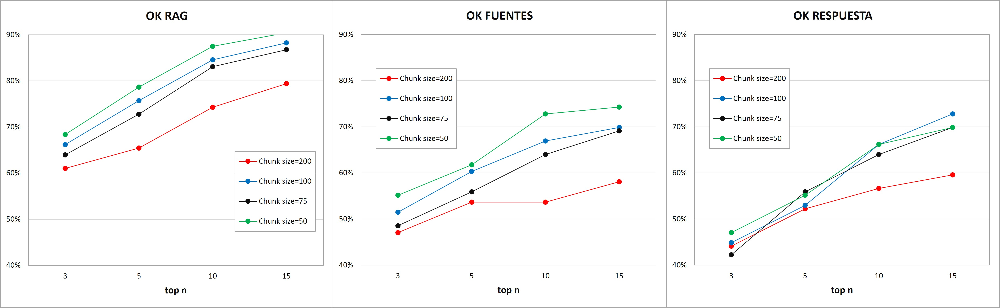

# <h1 style="font-size: 50px;">_Chatbot_ de la _Coppermind_, una _wikipedia_ del _Cosmere_</h1>  

# Introducción  

# Objetivos  

# Desarrollo

## I. *Creación de la base de datos* 

En primer lugar, he elegido la lista de entradas de la _wikipedia_ que quiero utilizar como base de datos. Me he decantado por centrarme no en una saga en concreto, sino en los conceptos que son comunes a toda saga, a todo el universo del _Cosmere_. Adjunto la [lista](https://drive.google.com/file/d/1-2jTNQljoHThvsco3jfIMhAOamoCOCqM/view?usp=sharing) con las urls de las entradas elegidas. He hecho un script que descarga el html a partir de la lista de urls. La descarga de cada entrada, al ser de una web, ha sido en formato html.   
(Script en Creación de base de datos-TFB.ipynb en local)
  
### I.II. Tratamiento de los htmls
Para optimizar el RAG he convertido los htmls en markdown. Además, he hecho cierto procesamiento para eliminar varias cosas:  

* Eliminación de vínculos a otras entradas de la _wikipedia_.  
* Eliminación de citas.  
* Eliminación de imágenes.  
* Eliminación de la sección de notas en adelante (sección donde se ponen todas las referencias, no aporta valor).  

De momento no voy a hacer más tratamiento al texto. Más adelante, con la ayuda del Test Automático, estudiaré si sería conveniente.

(Script en html_to_markdown.ipynb en local, luego subir markdowns al drive)

### I.III. Embeddings  
Una vez procesado el contenido de cada entrada, he dividido el texto completo de la base de datos en _chunks_ con un _overlap_ del 20% (el tamaño del _chunk_ está por ver, a estudiar con el Test Automático). He hecho los _embeddings_ con el modelo _paraphrase-MiniLM-L6-v2_, un modelo de transformers que es relativamente compacto y eficiente cuya principal aplicaciión es la búsqueda semántica. He obtenido el modelo de _Hugging Face_.  

El código divide el texto en _chunks_, hace los _embeddings_ de cada _chunk_ y guarda en _Google Drive_ cada _chunk_ y _embedding_ con varios metadatos asociados: el número de _chunk_ (entre todos los _chunks_ del documento), el número de documento o _DOCID_ (número de entrada de las totales) y su nombre (la _url_ asociada, o algo similar).  

(Script en Creación de la base de datos.ipynb, Google Colab)

## II. Funcionamiento del _RAG_

Un modelo _RAG_ (_Retrieval-Augmented Generation_) consiste en dos partes principales: búsqueda semántica y generación de la respuesta. La búsqueda semántica consiste en hallar un cierto número de _chunks_ de la base de datos que tienen mayor similitud con la pregunta del usuario. Una vez hallados, se le pide a un LLM componer una respuesta en base a esa pregunta y los chunks encontrados.  

### II.I. Búsqueda semántica
Una vez hechos y guardados los _embeddings_, podemos acceder a ellos mediante _Google Drive_. Al hacer una pregunta, se hace el _embedding_ de esa pregunta y se calcula la similitud entre esa pregunta y todos los _embeddings_ de la base de datos. Otro de los hiperparámetros, junto con el tamaño de _chunk_ y el _overlap_, es _top-n_, el número de chunks con más similitud que nos quedamos. El valor óptimo de este hiperparámetro también lo decidiremos con la ayuda del Test Automático.  

Al hacer una pregunta, obtenemos los _chunks_ con mayor similitud, el número de _chunk_, el _DOCID_, su nombre y la similitud entre ese _chunk_ y la pregunta. Quedaría esto:

Question: ¿Se puede leer algún libro del Cosmere sin haber leído otras sagas?
The 3 chunks most similar to your question are:
1. DOCID: 12 | Document Name: https://es.coppermind.net/wiki/Cosmere | Chunk number: 3 | Similarity: 0.6855  
subyacentes, apareciendo algunos personajes en otros mundos ajenos al suyo. A pesar de las conexiones, Brandon ha dejado claro que uno no necesita ningún conocimiento del Cosmere en general para leer, entender, o disfrutar de los libros que tienen lugar en él. Las secuencia principal del Cosmere consistirá en la saga *Dragonsteel*"), la trilogía de *Elantris*, al menos cuatro eras de la saga *Nacidos de la bruma*") y *El archivo de las tormentas*. La historia del Cosmere no incluye ningún libro que haga referencia a la Tierra, puesto que la tierra no está en el Cosmere. Para una lista completa

2. DOCID: 19 | Document Name: https://es.coppermind.net/wiki/Esquirla del Amanecer | Chunk number: 49 | Similarity: 0.6744  
no se refiera a Sigzil. En *Viento y verdad*, se confirmó que Hoid tuvo en su poder la Esquirla del Amanecer Existe durante los sucesos de los libros 1-5 de *El archivo de las tormentas*. ## Notes 1. ↑ a b c d e f g h i j k l m n o p q r s t u *Esquirla del Amanecer (novella)* capítulo 19")Summary: Esquirla del Amanecer (novella)/Chapter\_19/Chapter 19 (la página no existe)")#/Chapter 19") 2. ↑ a b General Reddit 2022 — Arcanum - 2022-12-02Cite: Arcanum-15961# 3. ↑ a b c Dawnshard Annotations Reddit Q&A — Arcanum -

3. DOCID: 24 | Document Name: https://es.coppermind.net/wiki/Hoid | Chunk number: 184 | Similarity: 0.6562  
qué libro fue eso respondió *Brazales de Duelo")*. * La misión de Hoid quizás sea: «hacer aquello que una vez fue». * Hoid no está impresionado por los Sangre Espectral. * Hoid detesta al Grupo, y los miembros de este último que le conocen también le detestan. * Aunque una vez le dijo a Kaladin (bastante acertado) que su vida comenzó como palabras en una página, este hecho no tenía la intención de romper la cuarta pared. * Hoid se ha travestido en el pasado, «muchas veces». * Antes de los eventos de *Palabras Radiantes*, a Hoid no le habían

Además, se puede obtener una gráfica interesante: el histograma de la similitud entre cada _chunk_ de la base de datos y la pregunta.  

  

(Script en Creación de la base de datos.ipynb, Google Colab)

## II.II. Generación de la respuesta

Esos _chunks_ con mayor similitud con la pregunta se le pasan, junto con la pregunta del usuario, a un LLM, pidiéndole que responda a la pregunta del usuario en base a los _chunks_ encontrados. 

El modelo seleecionado se decidirá más adelante a raíz de una serie de tests. Para esta y posteriores llamadas a LLMs se utilizarán varios proveedores que permiten hacer llamadas gratis vía API (ver [_LLMs_free_API_keys.ipynb_](https://drive.google.com/file/d/1F9DaZLL1n1gUDcGtaeGBuQ-fTJLYN5xE/view?usp=sharing) para más detalles).  

El _system prompt_ es el siguiente:  

    Eres un asistente virtual experto en responder preguntas. A continuación vas a recibir la pregunta de un usuario y el conocimiento que debes utilizar para responderla en el siguiente formato:

    Pregunta: Pregunta del usuario
    Conocimiento:
    Nombre del documento 1: contenido del documento 1
    Nombre del documento 2: contenido del documento 2
    ...
    Nombre del documento N: contenido del documento N

    Responde como si fueras un chatbot de una wikipedia. Después de dar tu respuesta completa, di el nombre de los documentos en los que te has basado para elaborarla. Si te has basado dos veces en el mismo documento, no lo repitas al referenciarlo. Hazlo en este formato:

    Pon aquí tu respuesta
    [[Pon aquí únicamente el nombre del primer documento en el que te has basado]]
    [[Pon aquí únicamente el nombre del segundo documento en el que te has basado, siempre y cuando no hayas puesto el mismo nombre antes]]
    ...

    No utilices conocimiento propio de tu entrenamiento, utiliza solo el que se te proporciona. Si parte del conocimiento que se te proporciona no te sirve para responder a la pregunta, no lo utilices. Cita únicamente los documentos en los que te has basado para elaborar la respuesta. Si con el conocimiento que se te proporciona no puedes responder a la pregunta, responde únicamente "Lo siento, no puedo responderte a esa pregunta" y no cites ningún documento.

El _user prompt_ es el siguiente:  

    Pregunta: {Pregunta del usuario}  

    Conocimiento:  
    {Nombre del documento del chunk}: {contenido del chunk}

Como se puede observar, no solo se le pide al LLM que componga la respuesta, sino que cite sus fuentes. De esta forma el usuario puede, con solo pinchar en el nombre de la referencia, acceder a dicha entrada de la _wikipedia_ mediante la _url_.

## III. Test Automático  

Con el objetivo de poder valorar si los cambios tienen un impacto positivo en el modelo, he creado un test de regresión, al que llamaré Test Automático. Este test consiste en 137 preguntas de las que sé la respuesta correcta, a la que llamaré respuesta _best_, y la entrada (o entradas) de la wikipedia donde se responde a esa pregunta, que llamaré documento _best_. El test consistirá en 3 subtests:  

* OK/KO RAG: Porcentaje de preguntas en las que el documento/s _best_ se encuentra entre los encontrados por la búsqueda semántica.  

* OK/KO LLM: Porcentaje de preguntas en las que el documento/s _best_ se encuentra entre los elegidos por el LLM para redactar la respuesta.  

* OK/KO LLM _as a judge_: Porcentaje de preguntas en las que un segundo LLM valora que la respuesta del primer modelo se ajusta a la respuesta _best_. El LLM elegido para el test de LLM _as a judge_ es el _Llama 3.3 70B versatile_, ya que es un LLM grande, la útima versión de los modelos _LLama_ y apto para gran variedad de tareas.   

(Script en Test Automático.ipynb, Google Colab)

El _system prompt_ es el siguiente:  

    Vas a recibir una pregunta de un usuario (Pregunta), la respuesta correcta a esta pregunta (Respuesta_Best) y una respuesta generada (Respuesta_Generada). Tus objetivos son los siguientes:
    1. Determinar si la Respuesta_Generada responde a la Pregunta.
    2. Determinar si la Respuesta_Generada concuerda con la Respuesta_Best y no la contradice.
    Tienes que hacer una valoración en detalle y razonando sobre tu valoración. Si la Respuesta_Generada no responde a la Pregunta, valorar como KO. Si la Respuesta_Generada concuerda con la Respuesta_Best y no la contradice, valorarla como OK. Si la Respuesta_Generada no concuerda con la Respuesta_Best y la contradice, valorarla como KO. No tener en cuenta posibles detalles adicionales que puedan estar incluidos en la Respuesta_Generada, siempre y cuando no contradigan la Respuesta_Best.

    Una vez hayas hecho tu razonamiento, cúentalo, y al final pon tu valoración en este formato:
    [[Valoración: OK/KO]]

El _user prompt_ es el siguiente:  

    Pregunta:  
    {Pregunta del usuario}  

    Respuesta_Best:  
    {Respuesta marcada como correcta}  

    Respuesta_Generada:  
    {Respuesta generada por el LLM}

EXPLICAR, DECIR LOS % OK, LLM AS A JUDGE?, ENLACE AL GS Y A UN EJEMPLO DEL GS EJECUTADO, ENLACE A EXCEL DE RESULTADOS, ETC.  

Las preguntas, documento/s _best_ y respuestas _best_ se pueden ver aquí: [_Input Test Automático.xlsx_](https://docs.google.com/spreadsheets/d/1gs--ymPUeTYjbyf6AwcPHpowz6-6ehQb/edit?usp=sharing&ouid=117815217117454739708&rtpof=true&sd=true).

### III.I. _Chunk size_, _overlap_ y _top n_

El primer objetivo de este test es determinar el tamaño óptimo de los _chunks_ de la base de datos. Para eso se ha ejecutado el test con varios _chunk size_ distintos, así como para varios _top n_ (el número de _chunks_ pasados al LLM para redactar la respuesta). En este caso se ha fijado el LLM de elaboración de la respuesta y varios de sus parámetros. El LLM ha sido _Google Gemini 2.0 pro experimental_, aunque más adelante se comaprarán varios modelos y se eligirá el mejor. La temperatura se ha fijado a 0 para aumentar la reproducibilidad de los tests y reducir su variabilidad. Además, se ha fijado la _repetition penalty_ a 0 para intentar producir respuestas concisas. Por último, el _chunk overlap_ se ha fijado por defecto al 20%.  

Se han hecho estas pruebas para un _chunk size_ de 50, 75, 100 y 200 tokens, y _top n_ de 3, 5, 10 y 15 _chunks_. El resultado en detalle de las pruebas puede verse aquí: [_Chunk sze-overlap-topn.xlsx_](https://docs.google.com/spreadsheets/d/1rY1Kpd-hpIVb6air6aGdrMKY75ROrlt2/edit?usp=sharing&ouid=117815217117454739708&rtpof=true&sd=true).  

| Chunk_size | top_n | OK RAG | OK FUENTES | OK RESPUESTA |
|------------|-------|--------|------------|--------------|
| 50         | 3     | 68,38% | 55,15%     | 47,06%       |
|            | 5     | 78,68% | 61,76%     | 55,15%       |
|            | 10    | 87,50% | 72,79%     | 66,18%       |
|            | 15    | 90,44% | 74,26%     | 69,85%       |
| 75         | 3     | 63,97% | 48,53%     | 42,22%       |
|            | 5     | 72,79% | 55,88%     | 55,88%       |
|            | 10    | 83,09% | 63,97%     | 63,97%       |
|            | 15    | 86,76% | 69,12%     | 69,85%       |
| **100**        | 3     | 66,18% | 51,47%     | 44,85%       |
|            | 5     | 75,74% | 60,29%     | 52,94%       |
|            | **10**    | **84,56%** | **66,91%**     | **66,18%**       |
|            | 15    | 88,24% | 69,85%     | 72,79%       |
| 200        | 3     | 61,03% | 47,06%     | 44,12%       |
|            | 5     | 65,44% | 53,68%     | 52,21%       |
|            | 10    | 74,26% | 53,68%     | 56,62%       |
|            | 15    | 79,41% | 58,09%     | 59,56%       |

  

  

A raíz de estos resultados se utilizará un _chunk size_ de 100 _tokens_ (por tanto, un _chunk overlap_ de 20 _tokens_) y un _top n_ de 10 _chunks_. Se escoge esto por varias razones. En primer lugar, es el que mayor porcentaje de OK arroja en OK de la respuesta para _top n_ de 10, junto a un _chunk size_ de 50. Se elige sobre este porque, para resultados iguales, un _chunk size_ de 100 ofrece más contexto. No se escoge _chunk size_ de 100 y _top n_ de 15 porque la mejora en esta métrica no es demasiada. Además, hay que tener en cuenta el tiempo de respuesta del modelo, una métrica que en este caso no se ha evaludao, pero que es fundamental, ya que esta aplicación de IA es un _chatbot_.  
En resumen, los parámetros elegidos han sido **_chunk size_ = 100 _tokens_, _chunk overlap_ = 20 _tokens_, _top n_ = 10 _chunks_**.  

Por otro lado, como más adelante se va a analizar el LLM a utilizar para responder a las preguntas, así como su temperatura, cabría preguntarse si este análisis fijando el LLM es válido para otros. La realidad es que no, pero se ha hecho así para reducir el número de pruebas a hacer. Aunque los resultados del análisis del _chunk size_, _overlap_ y _top n_ probablemente cambien de un LLM a otroz, se ha supuesto que no serán cambios significativos.  

### III.II. Modelo de _embeddings_  

En el momento que se hicieron los tests III.I pensaba que el modelo de _embeddings_ que estaba utilizando, _paraphrase-MiniLM-L6-v2_, era el mejor. Sin embargo, en una de las clases me hicieron saber que este modelo no está entrenado en español, por lo que es fundamental encontrar uno que funcione mejor entrenado específicamente en español.  

Lo ideal sería hacer primero este test y después el III.I, ya que es más determinante el modelo de _embeddings_ utilizado. Sin embargo, como el test III.I consume mucho tiempo, asumiremos el error producido por hacerlo en este orden.  

Los modelos de _embeddings_ que vamos a comparar son los siguientes:  

* _paraphrase-MiniLM-L6-v2_ (as-is, entrenado solo en inglés)
* _paraphrase-multilingual-MiniLM-L12-v2_  
* _paraphrase-multilingual-mpnet-base-v2_
* _distiluse-base-multilingual-cased-v2_
* _stsb-xlm-r-multilingual_
* _finetuned_sentence_similarity_spanish_

Por desgracia, y debido a las limitaciones de tener que usar llamadas gratis via API a LLMs ofrecidos por distintos proveedores, el LLM de elaboración de la respuesta que usé en el test III.I, _Google: Gemini Pro 2.0 Experimental (free)_, ya no está disponible. Debido a esto voy a tener que utilizar otro, _Google: Gemini 2.0 Flash Thinking Experimental 01-21 (free)_. Aún así, esto no invalida las conclusiones de este test.

La diferencia entre los resultados de los tests III.I y III.II se explica debido a que entre el primer test y el segundo hubo ciertas actualizaciones en la wikipedia.

### III.III. LLM de generación de la respuesta  

A continuación, se evaluará qué LLM se utilizará para generar la respuesta a partir del conocimiento encontrado. Para ello, se evaluarán las tres métricas anteriores (OK RAG, OK FUENTES y OK RESPUESTA), además del tiempo de respuesta de cada modelo.

# Puesta en producción

# Posibles mejoras

# Líneas a futuro

* **Crear un agente que haga búsquedas y decida cuántas hacer, el top_n y cuándo parar (así se podría hacer un chatbot de verdad).**
* **Usar structured outputs para las citas.**
* **Creación de una interfaz de chat estilo _chatgpt_.**  
* **Aplicación de un filtro de similitud. Por ejemplo, si no hay ningún chunk con similitud mayor que 0.6, responder "Lo siento, no tengo datos suficientes para responder a tu pregunta".**
* Detector de chit-chat.  
* Implementación real del *chat* (que no sea únicamente pregunta-respuesta aisladas, que recoja las preguntas anteriores de ese chat).  
* _RAG-fusion_: creación de preguntas de apoyo mediante un _LLM_.  
* Implementación de _Groundedness_ para medir alucinaciones y cómo de desviada está una respuesta de los _chunks_ encontrados. Muestra al usuario para prevenir?